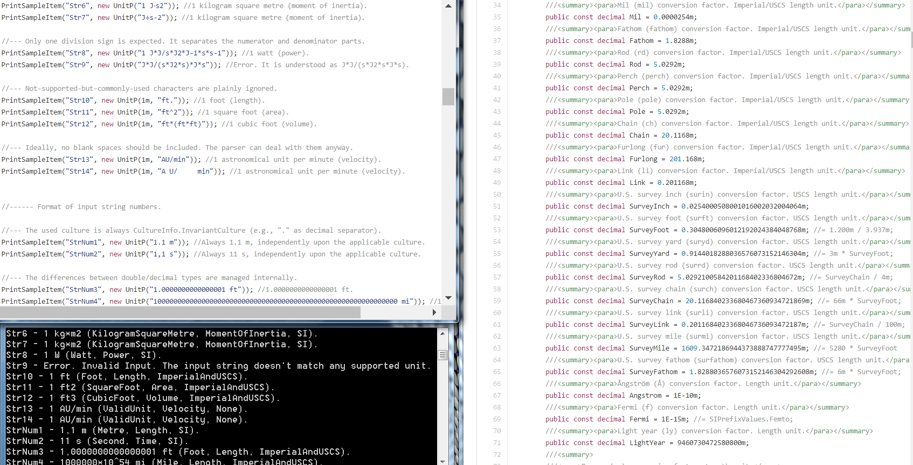

# Summary

UnitParser is a comprehensive .NET unit parsing library. It can recognise, simplify, classify and convert a wide variety of scenarios involving units of measurement. Additionally, it manages all the errors internally, supports big numbers and includes high quality hardcoded information.

-

# References